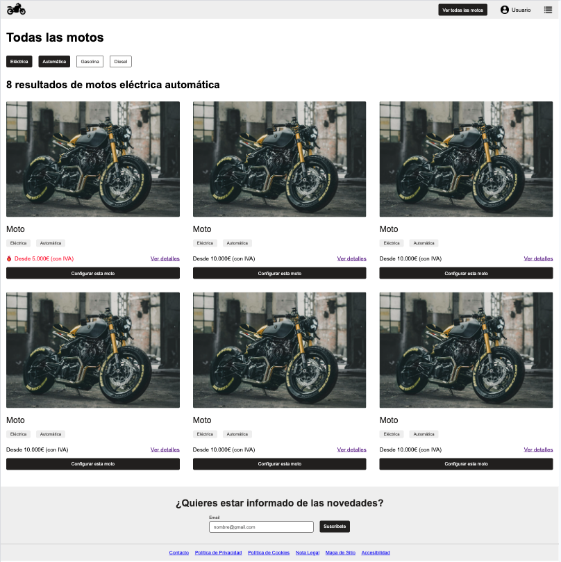
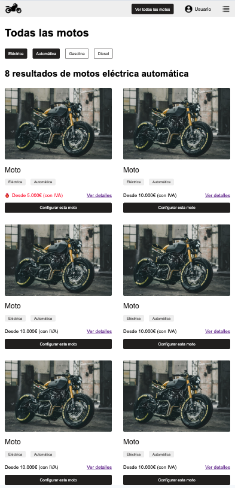
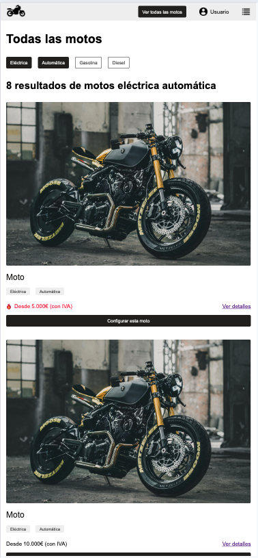

# Motorcicles-Web
Frontend elaborado en **HTML** y **CSS** en la que se recrea una web de motos.

## Descripción
Se ha desarrollado íntegramente en **HTML** y **CSS**, intentando aplicar buenas prácticas en el maquetado mediante principios de atomicidad Atomic Design, diseño responsive y Mobile First.
## Funcionalidades
Se ha seguido un diseño concreto de tipo Responsive de **FIGMA**.

## Enlaces

[Link referencia de Figma](https://www.figma.com/design/Y1Yl16UMFMOfd5Mr8eKfG1/Untitled?node-id=1-12&t=JKRL3VsW8Ik6SIAp-1)